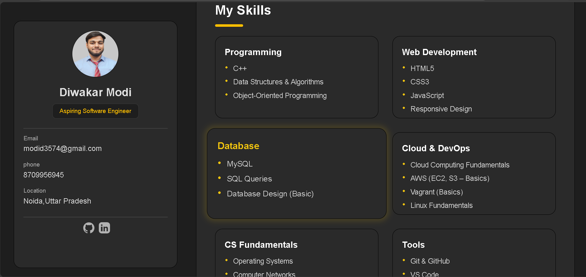

# 🚀 Personal Portfolio Website

This repository contains the source code for my **personal portfolio website**, created to showcase my **projects, technical skills, education, and hands-on experience** as a **B.Tech Computer Science student specializing in Cloud Computing**.

The portfolio features a clean, modern, and responsive design aimed at presenting my work professionally for **internship and job opportunities**.

---

## 🛠 Tech Stack
- HTML5  
- CSS3  

---

## ✨ Features
- Fully responsive layout for all screen sizes  
- Dedicated sections for About, Skills, Education, and Projects  
- Clean UI with smooth transitions and hover effects  
- Organized and easy-to-navigate structure  

---

## 📂 Projects Highlighted
- **Weather Forecasting Web App** – Displays real-time weather data using an external API  
- **Saathi Stays** – Room and hotel booking platform with database integration  

---

## 📸 Screenshots

  

  

  

---

## 🎯 Purpose
This portfolio is designed to:
- Showcase real-world projects and technical skills  
- Support internship and job applications  
- Demonstrate continuous learning and hands-on development experience  

---

## 🔗 Live Demo
(Add your live portfolio link here)

---

## 📬 Contact
- **Email:** modid3574@gmail.com  
- **LinkedIn:** https://www.linkedin.com/in/diwakar-modi-b6675a22b  
- **GitHub:** https://github.com/Diwa0914  

---

⭐ Feel free to explore the repository and connect with me!

